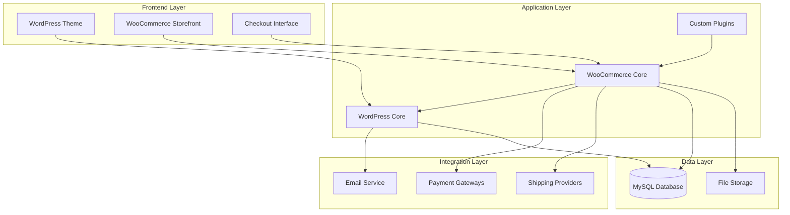

# Design Document: COMPIA E-commerce Platform

## Overview

A plataforma de e-commerce da COMPIA será construída sobre WordPress com WooCommerce, aproveitando o ecossistema maduro de plugins e temas. A arquitetura seguirá o padrão MVC do WordPress, com WooCommerce fornecendo a camada de e-commerce e plugins adicionais para funcionalidades específicas como integração de pagamentos e cálculo de frete.

A solução prioriza facilidade de uso para administradores não-técnicos, utilizando interfaces administrativas visuais do WordPress/WooCommerce. A plataforma será hospedada em ambiente compatível (Vercel ou alternativa com suporte PHP) com PHP 8+, MySQL/MariaDB e HTTPS obrigatório.

### Key Design Decisions

1. **WordPress + WooCommerce**: Plataforma estabelecida com vasta documentação, plugins e suporte comunitário
2. **Plugin-based Architecture**: Utilizar plugins existentes para pagamentos, frete e funcionalidades específicas ao invés de desenvolvimento customizado
3. **Theme Customization**: Usar tema gratuito responsivo como base, com customizações mínimas via CSS
4. **API-first for Integrations**: Utilizar APIs REST do WooCommerce para integrações com gateways de pagamento e transportadoras

## Architecture

### High-Level Architecture



### Component Responsibilities

**WordPress Core**:
- User authentication and authorization
- Content management
- Plugin and theme management
- Database abstraction layer

**WooCommerce Core**:
- Product catalog management
- Shopping cart functionality
- Order processing and management
- Payment gateway integration framework
- Shipping calculation framework

**Custom Plugins/Configuration**:
- Brazilian payment gateway integrations (PIX, PagSeguro, Mercado Pago)
- Correios shipping integration
- Digital product delivery automation
- Custom email templates for Brazilian market

**Theme Layer**:
- Responsive design implementation
- Product display templates
- Checkout flow UI
- Customer account pages

## Components and Interfaces

### 1. Product Management Component

**Responsibilities**:
- CRUD operations for products
- Product categorization and tagging
- Image management
- Stock tracking
- Product type differentiation (physical vs digital)

**Key Interfaces**:

```php
interface ProductManager {
    function createProduct(productData: ProductData): Product
    function updateProduct(productId: int, productData: ProductData): Product
    function deleteProduct(productId: int): bool
    function getProduct(productId: int): Product
    function listProducts(filters: ProductFilters): Product[]
}

interface ProductData {
    title: string
    description: string
    price: decimal
    stockQuantity: int
    categories: int[]
    tags: int[]
    images: string[]
    productType: 'physical' | 'digital'
    downloadableFile?: string  // Required for digital products
}
```

**Implementation Notes**:
- Utiliza WooCommerce native product types (simple, downloadable)
- Leverages WordPress media library for image management
- Uses WooCommerce taxonomy system for categories and tags

### 2. Shopping Cart Component

**Responsibilities**:
- Add/remove products from cart
- Update product quantities
- Calculate cart totals
- Persist cart state (session or database)
- Validate product availability

**Key Interfaces**:

```php
interface CartManager {
    function addItem(productId: int, quantity: int): CartItem
    function removeItem(cartItemId: string): bool
    function updateQuantity(cartItemId: string, quantity: int): CartItem
    function getCart(): Cart
    function clearCart(): bool
    function calculateTotal(): CartTotal
}

interface Cart {
    items: CartItem[]
    subtotal: decimal
    tax: decimal
    shipping: decimal
    total: decimal
}

interface CartItem {
    id: string
    productId: int
    productName: string
    quantity: int
    price: decimal
    subtotal: decimal
}
```

**Implementation Notes**:
- Uses WooCommerce session management
- Cart persists across sessions for logged-in users
- Real-time stock validation on add/update operations

### 3. Checkout Component

**Responsibilities**:
- Collect customer information
- Calculate shipping costs
- Calculate taxes
- Validate order before payment
- Coordinate with payment gateway
- Create order records

**Key Interfaces**:

```php
interface CheckoutProcessor {
    function validateCheckout(checkoutData: CheckoutData): ValidationResult
    function calculateShipping(destination: Address, items: CartItem[]): ShippingOptions
    function calculateTax(destination: Address, subtotal: decimal): decimal
    function processCheckout(checkoutData: CheckoutData): Order
}

interface CheckoutData {
    customerInfo: CustomerInfo
    billingAddress: Address
    shippingAddress?: Address  // Optional for digital-only orders
    shippingMethod?: string    // Optional for digital-only orders
    paymentMethod: string
    cartItems: CartItem[]
}

interface ShippingOptions {
    options: ShippingOption[]
}

interface ShippingOption {
    providerId: string
    providerName: string
    serviceName: string
    cost: decimal
    estimatedDays: int
}
```

**Implementation Notes**:
- Integrates with WooCommerce checkout hooks
- Uses WooCommerce shipping zones and methods
- Validates stock availability before order creation

### 4. Payment Gateway Component

**Responsibilities**:
- Interface with external payment processors
- Handle payment callbacks/webhooks
- Update order status based on payment status
- Generate PIX QR codes
- Process credit card transactions

**Key Interfaces**:

```php
interface PaymentGateway {
    function processPayment(order: Order, paymentData: PaymentData): PaymentResult
    function handleWebhook(webhookData: WebhookData): bool
    function refundPayment(orderId: int, amount: decimal): RefundResult
}

interface PaymentData {
    method: 'credit_card' | 'pix'
    amount: decimal
    orderId: int
    customerInfo: CustomerInfo
    creditCardData?: CreditCardData
}

interface PaymentResult {
    success: bool
    transactionId?: string
    pixQrCode?: string
    pixCode?: string
    errorMessage?: string
}
```

**Implementation Notes**:
- Each gateway (PagSeguro, Mercado Pago, Stripe, PayPal) implements PaymentGateway interface
- Uses WooCommerce payment gateway framework
- Webhooks update order status asynchronously
- PIX integration specific to Brazilian gateways (PagSeguro, Mercado Pago)

### 5. Order Management Component

**Responsibilities**:
- Create and store orders
- Update order status
- Track order history
- Generate order reports
- Manage order lifecycle

**Key Interfaces**:

```php
interface OrderManager {
    function createOrder(checkoutData: CheckoutData): Order
    function updateOrderStatus(orderId: int, status: OrderStatus): Order
    function getOrder(orderId: int): Order
    function listOrders(filters: OrderFilters): Order[]
    function getCustomerOrders(customerId: int): Order[]
}

interface Order {
    id: int
    orderNumber: string
    customerId: int
    customerInfo: CustomerInfo
    items: OrderItem[]
    subtotal: decimal
    tax: decimal
    shipping: decimal
    total: decimal
    paymentMethod: string
    paymentStatus: PaymentStatus
    orderStatus: OrderStatus
    shippingAddress?: Address
    billingAddress: Address
    createdAt: datetime
    updatedAt: datetime
}

enum OrderStatus {
    PENDING
    PROCESSING
    COMPLETED
    CANCELLED
    REFUNDED
    FAILED
}

enum PaymentStatus {
    PENDING
    PAID
    FAILED
    REFUNDED
}
```

**Implementation Notes**:
- Uses WooCommerce order post type
- Leverages WooCommerce order status system
- Stores order metadata using WordPress meta tables

### 6. Shipping Integration Component

**Responsibilities**:
- Calculate shipping costs
- Integrate with Correios API
- Integrate with private carriers
- Generate shipping labels
- Track shipments

**Key Interfaces**:

```php
interface ShippingProvider {
    function calculateShipping(origin: Address, destination: Address, package: Package): ShippingQuote[]
    function createShipment(order: Order): Shipment
    function trackShipment(trackingCode: string): TrackingInfo
}

interface Package {
    weight: decimal  // kg
    dimensions: Dimensions  // cm
    value: decimal
}

interface Dimensions {
    length: decimal
    width: decimal
    height: decimal
}

interface ShippingQuote {
    serviceCode: string
    serviceName: string
    cost: decimal
    deliveryDays: int
}

interface Shipment {
    trackingCode: string
    label?: string  // URL or base64
    estimatedDelivery: date
}
```

**Implementation Notes**:
- Correios integration via plugin (WooCommerce Correios)
- Private carriers via WooCommerce shipping methods
- Shipping zones configured for Brazilian states
- Package dimensions calculated from product metadata

### 7. Digital Product Delivery Component

**Responsibilities**:
- Store digital product files securely
- Generate time-limited download links
- Verify purchase before allowing download
- Track download attempts
- Send download links via email

**Key Interfaces**:

```php
interface DigitalDelivery {
    function generateDownloadLink(orderId: int, productId: int): DownloadLink
    function verifyDownloadAccess(token: string): AccessResult
    function trackDownload(orderId: int, productId: int): bool
    function sendDownloadEmail(orderId: int): bool
}

interface DownloadLink {
    url: string
    expiresAt: datetime
    downloadLimit: int
}

interface AccessResult {
    allowed: bool
    fileUrl?: string
    errorMessage?: string
}
```

**Implementation Notes**:
- Uses WooCommerce downloadable product functionality
- Files stored outside web root with access control
- Download links expire after 7 days or 5 downloads (configurable)
- Email sent automatically on payment confirmation

### 8. Email Notification Component

**Responsibilities**:
- Send transactional emails
- Template management
- Email delivery tracking
- Queue management for bulk emails

**Key Interfaces**:

```php
interface EmailService {
    function sendOrderConfirmation(order: Order): bool
    function sendPaymentConfirmation(order: Order): bool
    function sendShippingNotification(order: Order, tracking: TrackingInfo): bool
    function sendDownloadLinks(order: Order, links: DownloadLink[]): bool
    function sendCustomEmail(recipient: string, subject: string, body: string): bool
}

interface EmailTemplate {
    templateId: string
    subject: string
    bodyHtml: string
    bodyText: string
    variables: string[]
}
```

**Implementation Notes**:
- Uses WordPress wp_mail() function
- WooCommerce email templates customized for Brazilian market
- SMTP plugin for reliable delivery (e.g., WP Mail SMTP)
- Email queue for high-volume scenarios

### 9. User Authentication and Authorization Component

**Responsibilities**:
- User registration and login
- Password management
- Role-based access control
- Session management
- Activity logging

**Key Interfaces**:

```php
interface AuthManager {
    function register(userData: UserRegistration): User
    function login(email: string, password: string): AuthResult
    function logout(userId: int): bool
    function resetPassword(email: string): bool
    function checkPermission(userId: int, permission: string): bool
}

interface User {
    id: int
    email: string
    firstName: string
    lastName: string
    role: 'administrator' | 'customer'
    createdAt: datetime
}

interface AuthResult {
    success: bool
    user?: User
    token?: string
    errorMessage?: string
}
```

**Implementation Notes**:
- Uses WordPress native user system
- WooCommerce customer role for buyers
- WordPress administrator role for store managers
- Activity logging via plugin (Simple History or WP Activity Log)

## Data Models

### Product Model

```php
class Product {
    id: int
    title: string
    slug: string
    description: string
    shortDescription: string
    price: decimal
    salePrice?: decimal
    stockQuantity: int
    stockStatus: 'instock' | 'outofstock' | 'onbackorder'
    productType: 'physical' | 'digital'
    categories: Category[]
    tags: Tag[]
    images: Image[]
    downloadableFile?: File  // For digital products
    weight?: decimal  // For physical products (kg)
    dimensions?: Dimensions  // For physical products (cm)
    createdAt: datetime
    updatedAt: datetime
}

class Category {
    id: int
    name: string
    slug: string
    parentId?: int
}

class Tag {
    id: int
    name: string
    slug: string
}

class Image {
    id: int
    url: string
    alt: string
    position: int
}
```

### Order Model

```php
class Order {
    id: int
    orderNumber: string
    customerId: int
    customerEmail: string
    customerFirstName: string
    customerLastName: string
    items: OrderItem[]
    subtotal: decimal
    taxTotal: decimal
    shippingTotal: decimal
    discountTotal: decimal
    total: decimal
    currency: string  // 'BRL'
    paymentMethod: string
    paymentMethodTitle: string
    transactionId?: string
    paymentStatus: PaymentStatus
    orderStatus: OrderStatus
    billingAddress: Address
    shippingAddress?: Address
    shippingMethod?: string
    shippingMethodTitle?: string
    trackingCode?: string
    customerNote?: string
    createdAt: datetime
    paidAt?: datetime
    completedAt?: datetime
}

class OrderItem {
    id: int
    productId: int
    productName: string
    quantity: int
    price: decimal
    subtotal: decimal
    tax: decimal
    total: decimal
    downloadUrl?: string  // For digital products
}

enum OrderStatus {
    PENDING = 'pending'
    PROCESSING = 'processing'
    ON_HOLD = 'on-hold'
    COMPLETED = 'completed'
    CANCELLED = 'cancelled'
    REFUNDED = 'refunded'
    FAILED = 'failed'
}

enum PaymentStatus {
    PENDING = 'pending'
    PAID = 'paid'
    FAILED = 'failed'
    REFUNDED = 'refunded'
}
```

### Customer Model

```php
class Customer {
    id: int
    email: string
    firstName: string
    lastName: string
    username: string
    role: string
    billingAddress?: Address
    shippingAddress?: Address
    orders: Order[]
    createdAt: datetime
}

class Address {
    firstName: string
    lastName: string
    company?: string
    address1: string
    address2?: string
    city: string
    state: string  // Brazilian state code (SP, RJ, etc.)
    postcode: string  // CEP
    country: string  // 'BR'
    phone: string
}
```

### Cart Model

```php
class Cart {
    sessionId: string
    customerId?: int
    items: CartItem[]
    subtotal: decimal
    tax: decimal
    shipping: decimal
    total: decimal
    appliedCoupons: string[]
    createdAt: datetime
    updatedAt: datetime
}

class CartItem {
    key: string  // Unique cart item identifier
    productId: int
    variationId?: int
    quantity: int
    price: decimal
    subtotal: decimal
}
```

### Payment Models

```php
class PaymentTransaction {
    id: int
    orderId: int
    gatewayId: string  // 'pagseguro', 'mercadopago', 'stripe', 'paypal'
    transactionId: string  // Gateway transaction ID
    amount: decimal
    status: PaymentStatus
    method: 'credit_card' | 'pix'
    pixQrCode?: string
    pixCode?: string
    pixExpiresAt?: datetime
    createdAt: datetime
    updatedAt: datetime
}

class CreditCardData {
    cardNumber: string  // Tokenized, never stored in full
    cardHolderName: string
    expiryMonth: int
    expiryYear: int
    cvv: string  // Never stored
    brand: 'visa' | 'mastercard' | 'amex' | 'elo'
}
```

### Shipping Models

```php
class ShippingZone {
    id: int
    name: string
    regions: Region[]
    methods: ShippingMethod[]
}

class ShippingMethod {
    id: string
    title: string
    enabled: bool
    cost: decimal
    taxStatus: 'taxable' | 'none'
    minAmount?: decimal
    maxAmount?: decimal
}

class Shipment {
    id: int
    orderId: int
    provider: string  // 'correios', 'jadlog', etc.
    serviceCode: string
    trackingCode: string
    shippedAt: datetime
    estimatedDelivery: date
    status: ShipmentStatus
}

enum ShipmentStatus {
    PENDING = 'pending'
    SHIPPED = 'shipped'
    IN_TRANSIT = 'in-transit'
    DELIVERED = 'delivered'
    FAILED = 'failed'
}
```


## Correctness Properties

*A property is a characteristic or behavior that should hold true across all valid executions of a system—essentially, a formal statement about what the system should do. Properties serve as the bridge between human-readable specifications and machine-verifiable correctness guarantees.*

### Property 1: Product Creation Completeness

*For any* valid product data containing title, description, price, stock quantity, categories, tags, and images, creating a product should result in a stored product that contains all the provided fields.

**Validates: Requirements 1.1**

### Property 2: Product Update Propagation

*For any* existing product and valid update data, updating the product should result in the updated information being immediately retrievable when querying the product.

**Validates: Requirements 1.2**

### Property 3: Product Deletion Removes Availability

*For any* existing product, deleting it should result in the product no longer appearing in storefront listings and being unavailable for cart operations.

**Validates: Requirements 1.3**

### Property 4: Multiple Categories and Tags Support

*For any* product with multiple categories and tags, all assigned categories and tags should be stored and retrievable with the product.

**Validates: Requirements 1.4**

### Property 5: Multiple Images Support

*For any* product with multiple images, all uploaded images should be stored, retrievable, and maintain their order.

**Validates: Requirements 1.5**

### Property 6: Product Type Differentiation

*For any* product created as either physical or digital type, the product type should be stored correctly and affect downstream behavior (digital products skip shipping, physical products require it).

**Validates: Requirements 1.6**

### Property 7: Digital Product File Requirement

*For any* attempt to create a digital product without a downloadable file, the creation should be rejected with an appropriate error message.

**Validates: Requirements 1.7**

### Property 8: Cart Addition Updates State

*For any* product and cart, adding the product to the cart should result in the cart containing the product and the cart total reflecting the product price.

**Validates: Requirements 2.1**

### Property 9: Cart Removal Updates State

*For any* cart with multiple items, removing one item should result in that item no longer being in the cart and the total being recalculated without that item's price.

**Validates: Requirements 2.2**

### Property 10: Cart Display Completeness

*For any* cart with items, the cart display should include all products with their quantities, individual prices, and the total price.

**Validates: Requirements 2.3**

### Property 11: Shipping Info Required for Physical Products

*For any* cart containing at least one physical product, proceeding to checkout should require shipping information, while carts containing only digital products should not require shipping information.

**Validates: Requirements 2.4, 2.6**

### Property 12: Shipping Cost Calculation

*For any* valid destination address and cart with physical products, the platform should calculate shipping costs that are non-negative and vary based on destination and selected shipping provider.

**Validates: Requirements 2.5**

### Property 13: Checkout Creates Complete Order

*For any* completed checkout with valid data, an order should be created containing all transaction details including customer info, items, pricing breakdown, payment method, and shipping information (when applicable).

**Validates: Requirements 2.8**

### Property 14: PIX Payment Generation

*For any* order using PIX payment method, initiating payment should generate both a QR code and a text payment code.

**Validates: Requirements 3.3**

### Property 15: Payment Confirmation Updates Order Status

*For any* order in pending payment status, when payment is confirmed (PIX or credit card), the order status should automatically update to processing or completed.

**Validates: Requirements 3.4, 3.5**

### Property 16: Payment Failure Handling

*For any* order where payment fails, the order should remain in pending status and a notification should be sent to the customer.

**Validates: Requirements 3.6**

### Property 17: Credit Card Storage Security

*For any* completed credit card payment, the database should not contain the complete credit card number in plaintext.

**Validates: Requirements 3.8**

### Property 18: Order Notification on Creation

*For any* newly created order, a confirmation email should be sent to the customer's email address.

**Validates: Requirements 4.2, 9.1**

### Property 19: Order Status Change Notifications

*For any* order status change, a notification email should be sent to the customer with the updated status information.

**Validates: Requirements 4.3, 9.2, 9.3**

### Property 20: Order Status Update Persistence

*For any* order and valid status value, when an administrator updates the order status, the new status should persist and be retrievable.

**Validates: Requirements 4.4**

### Property 21: Order Filtering Accuracy

*For any* set of orders and filter criteria (status, date range, or customer), the filtered results should only include orders matching all specified criteria.

**Validates: Requirements 4.5**

### Property 22: Order Details Completeness

*For any* order, retrieving order details should return complete information including all products, payment method, shipping information, and customer data.

**Validates: Requirements 4.6**

### Property 23: Customer Order History Access

*For any* authenticated customer, retrieving their order history should return only their own orders with complete status and details.

**Validates: Requirements 4.7**

### Property 24: Physical Product Shipping Calculation

*For any* order containing physical products, shipping cost calculation should be invoked and return at least one shipping option with cost and delivery estimate.

**Validates: Requirements 5.1**

### Property 25: Local Pickup Skips Shipping Cost

*For any* order with physical products where local pickup is selected, the shipping cost should be zero.

**Validates: Requirements 5.5**

### Property 26: Digital Product Download Link Generation

*For any* order containing digital products where payment is confirmed, download links should be generated for all digital products in the order.

**Validates: Requirements 5.6**

### Property 27: Download Access Control

*For any* download link access attempt, the download should only be allowed if the associated order has paid payment status.

**Validates: Requirements 5.7**

### Property 28: Download Link Email Delivery

*For any* order with digital products where payment is confirmed, an email containing download links should be sent to the customer.

**Validates: Requirements 5.8, 9.4**

### Property 29: Unauthenticated Admin Access Denial

*For any* administrative operation attempted without valid authentication, the operation should be denied and the attempt should be logged.

**Validates: Requirements 6.2**

### Property 30: Unauthenticated Customer Resource Access Denial

*For any* attempt to access order history or download links without authentication, access should be denied.

**Validates: Requirements 6.3**

### Property 31: Administrative Action Logging

*For any* administrative action performed, a log entry should be created containing the action type, timestamp, and administrator user identification.

**Validates: Requirements 6.4**

### Property 32: Password Storage Security

*For any* user account created or password updated, the password stored in the database should be hashed and not stored in plaintext.

**Validates: Requirements 6.6**

### Property 33: Unauthorized Access Logging

*For any* unauthorized access attempt, the attempt should be denied and a log entry should be created with timestamp and attempted resource.

**Validates: Requirements 6.7**

### Property 34: CSV Product Import Accuracy

*For any* valid CSV file containing product data, importing the file should create products with data matching the CSV contents.

**Validates: Requirements 8.3**

### Property 35: Product Immediate Availability

*For any* newly created product, the product should immediately appear in storefront queries and be available for purchase.

**Validates: Requirements 8.4**

### Property 36: Product Search Relevance

*For any* product with specific title, author, or keywords, searching for those terms should return the product in the results.

**Validates: Requirements 8.6**

### Property 37: Email Content Completeness

*For any* notification email sent by the platform, the email should contain complete order details including order number, items, and total.

**Validates: Requirements 9.5**

### Property 38: Tax Calculation Based on Destination

*For any* checkout with a destination address, taxes should be calculated according to the destination's tax rules and included in the order total.

**Validates: Requirements 10.2**

### Property 39: Shipping Cost Inclusion in Total

*For any* order requiring shipping, the order total should equal the sum of subtotal, taxes, and shipping costs.

**Validates: Requirements 10.3**

### Property 40: Pricing Breakdown Completeness

*For any* order, the pricing breakdown should display subtotal, taxes, shipping cost, and total as separate line items.

**Validates: Requirements 10.4**

### Property 41: Brazilian Currency Formatting

*For any* price displayed on the platform, the price should be formatted in Brazilian Real (BRL) format with proper thousands separator and decimal places (R$ X.XXX,XX).

**Validates: Requirements 10.6**

## Error Handling

### Payment Errors

**Scenarios**:
- Gateway timeout or unavailability
- Invalid payment credentials
- Insufficient funds
- Card declined

**Handling Strategy**:
- Maintain order in pending status
- Display user-friendly error message
- Log detailed error for administrator review
- Send email notification to customer with retry instructions
- Provide alternative payment method options

### Shipping Calculation Errors

**Scenarios**:
- Invalid destination address
- Shipping provider API unavailable
- No shipping methods available for destination

**Handling Strategy**:
- Display clear error message to customer
- Suggest address correction if validation fails
- Offer alternative shipping methods if available
- Allow local pickup as fallback option
- Log error for administrator investigation

### Stock Availability Errors

**Scenarios**:
- Product out of stock during checkout
- Stock depleted between cart and checkout
- Concurrent purchases exceeding stock

**Handling Strategy**:
- Validate stock before payment processing
- Remove unavailable items from cart with notification
- Offer backorder option if configured
- Update cart total after stock validation
- Prevent overselling through database transactions

### File Download Errors

**Scenarios**:
- Download link expired
- File not found
- Unauthorized access attempt
- Download limit exceeded

**Handling Strategy**:
- Verify order payment status before serving file
- Generate new download link if expired (for paid orders)
- Log unauthorized access attempts
- Display clear error message with support contact
- Allow administrators to manually send new download links

### Authentication Errors

**Scenarios**:
- Invalid credentials
- Expired session
- Insufficient permissions

**Handling Strategy**:
- Redirect to login page with return URL
- Display clear error message
- Log failed authentication attempts
- Implement rate limiting for brute force protection
- Provide password reset functionality

## Testing Strategy

### Dual Testing Approach

The platform will employ both unit testing and property-based testing to ensure comprehensive coverage:

**Unit Tests**: Focus on specific examples, edge cases, and error conditions
- Specific product creation scenarios
- Edge cases like empty carts, zero-price products
- Error conditions like payment failures, invalid addresses
- Integration points between WordPress and WooCommerce

**Property Tests**: Verify universal properties across all inputs
- Product CRUD operations with randomized data
- Cart operations with varying product combinations
- Order processing with different payment and shipping scenarios
- Email notifications across different order states
- Access control with various authentication states

Both approaches are complementary and necessary for comprehensive coverage. Unit tests catch concrete bugs in specific scenarios, while property tests verify general correctness across the input space.

### Property-Based Testing Configuration

**Library Selection**: 
- PHP: Use **Eris** (property-based testing library for PHP)
- JavaScript (if needed for frontend): Use **fast-check**

**Test Configuration**:
- Minimum 100 iterations per property test
- Each property test must reference its design document property
- Tag format: **Feature: compia-ecommerce, Property {number}: {property_text}**
- Each correctness property will be implemented by a single property-based test

**Example Property Test Structure**:

```php
/**
 * Feature: compia-ecommerce, Property 8: Cart Addition Updates State
 * 
 * For any product and cart, adding the product to the cart should result 
 * in the cart containing the product and the cart total reflecting the product price.
 */
function testCartAdditionUpdatesState() {
    eris()
        ->forAll(
            Generator\product(),
            Generator\cart()
        )
        ->then(function($product, $cart) {
            $initialTotal = $cart->getTotal();
            $cart->addItem($product->getId(), 1);
            
            assert($cart->hasProduct($product->getId()));
            assert($cart->getTotal() === $initialTotal + $product->getPrice());
        })
        ->repeat(100);
}
```

### Test Coverage Areas

**Product Management**:
- Unit tests: Specific product types, image upload edge cases
- Property tests: CRUD operations with randomized product data (Properties 1-7)

**Shopping Cart**:
- Unit tests: Empty cart, maximum quantity limits
- Property tests: Add/remove operations, total calculations (Properties 8-12)

**Checkout and Orders**:
- Unit tests: Specific checkout flows, validation errors
- Property tests: Order creation, pricing calculations (Properties 13, 38-40)

**Payment Processing**:
- Unit tests: Specific gateway responses, webhook payloads
- Property tests: Payment status updates, security requirements (Properties 14-17)

**Order Management**:
- Unit tests: Specific status transitions, filter combinations
- Property tests: Order operations, filtering, access control (Properties 18-23)

**Distribution**:
- Unit tests: Specific shipping providers, tracking formats
- Property tests: Shipping calculations, download access (Properties 24-28)

**Security**:
- Unit tests: Specific attack vectors, SQL injection attempts
- Property tests: Access control, logging, password security (Properties 29-33)

**Search and Import**:
- Unit tests: Specific search queries, malformed CSV files
- Property tests: Search relevance, CSV import accuracy (Properties 34-36)

**Notifications and Formatting**:
- Unit tests: Specific email templates, edge case prices
- Property tests: Email delivery, content completeness, formatting (Properties 37, 41)

### Integration Testing

Beyond unit and property tests, integration testing will verify:
- WordPress and WooCommerce plugin interactions
- Payment gateway webhook handling
- Email delivery through SMTP
- Shipping provider API integration
- Database transaction integrity

### Manual Testing Requirements

Some requirements require manual verification:
- Responsive design on actual devices (Requirements 7.1-7.5)
- UI/UX quality and ease of use (Requirements 1.8, 7.6)
- Performance under load (Requirements 7.7, 8.5, 8.7)
- Brazilian tax regulation compliance (Requirement 10.5)

## Implementation Notes

### WordPress/WooCommerce Setup

**Required Plugins**:
- WooCommerce (core e-commerce functionality)
- WooCommerce Correios (Brazilian shipping integration)
- Payment gateway plugins:
  - WooCommerce PagSeguro (PIX + credit card)
  - WooCommerce Mercado Pago (PIX + credit card)
  - WooCommerce Stripe (credit card, international)
  - WooCommerce PayPal (alternative payment)
- WP Mail SMTP (reliable email delivery)
- Simple History or WP Activity Log (activity logging)
- WooCommerce PDF Invoices (Brazilian fiscal requirements)

**Theme Selection**:
- Storefront (official WooCommerce theme, free)
- Astra (lightweight, highly customizable, free)
- OceanWP (e-commerce focused, free)

**Server Requirements**:
- PHP 8.0 or higher
- MySQL 5.7+ or MariaDB 10.3+
- HTTPS/SSL certificate
- Memory limit: 256MB minimum
- Max execution time: 300 seconds

### Database Schema Extensions

WooCommerce uses WordPress database structure with custom tables:

**Core Tables** (provided by WooCommerce):
- wp_posts (products, orders)
- wp_postmeta (product/order metadata)
- wp_woocommerce_order_items
- wp_woocommerce_order_itemmeta
- wp_users (customers, administrators)
- wp_usermeta (customer metadata)

**Custom Metadata Keys** (to be added):
- Product: _downloadable_file, _product_type, _stock_quantity
- Order: _payment_method, _transaction_id, _tracking_code, _pix_qr_code
- Customer: _billing_address, _shipping_address

### Security Considerations

**Data Protection**:
- All payment processing through PCI-compliant gateways
- Credit card data never stored locally (tokenization)
- HTTPS enforced for all pages
- WordPress security hardening (disable file editing, limit login attempts)
- Regular security updates for WordPress, WooCommerce, and plugins

**Access Control**:
- WordPress role system (Administrator, Shop Manager, Customer)
- WooCommerce capabilities for granular permissions
- Two-factor authentication plugin for administrators (optional but recommended)
- Activity logging for audit trail

**File Security**:
- Digital product files stored outside public web directory
- Download links use time-limited tokens
- Download limit enforcement (default: 5 downloads per purchase)
- File access validation before serving

### Performance Optimization

**Caching Strategy**:
- Object caching (Redis or Memcached)
- Page caching for product pages (exclude cart/checkout)
- Database query caching
- CDN for static assets (images, CSS, JS)

**Database Optimization**:
- Indexes on frequently queried fields (product SKU, order status, customer email)
- Regular database optimization (wp_optimize plugin)
- Archive old orders (>2 years) to separate table

**Image Optimization**:
- Automatic image compression (Smush or ShortPixel plugin)
- Lazy loading for product images
- WebP format support
- Responsive image sizes

### Deployment Architecture

**Hosting Considerations**:
- Vercel does not natively support PHP - alternative needed
- Recommended: Hostinger, SiteGround, or Kinsta (WordPress-optimized)
- Alternative: AWS Lightsail, DigitalOcean App Platform
- Requirements: PHP 8+, MySQL, SSL, sufficient storage for digital files

**Environment Setup**:
- Development: Local WordPress installation (Local by Flywheel or XAMPP)
- Staging: Clone of production for testing
- Production: Managed WordPress hosting with daily backups

**Deployment Process**:
1. Install WordPress and WooCommerce on hosting
2. Install and configure required plugins
3. Install and customize theme
4. Configure payment gateways with API credentials
5. Configure shipping zones and methods
6. Import initial product catalog
7. Test complete purchase flow
8. Enable SSL and security hardening
9. Configure backup schedule
10. Go live

### Localization for Brazilian Market

**Currency and Formatting**:
- Currency: BRL (R$)
- Decimal separator: comma (,)
- Thousands separator: period (.)
- Format: R$ 1.234,56

**Address Format**:
- CEP (postal code) validation
- Brazilian state codes (SP, RJ, MG, etc.)
- Address fields: Street, Number, Complement, Neighborhood, City, State, CEP

**Tax Considerations**:
- ICMS (state tax) calculation based on destination state
- PIS/COFINS (federal taxes) included in product price
- Tax display: "Preço já inclui impostos" (Price includes taxes)

**Payment Methods**:
- PIX: QR code + copy-paste code, instant confirmation
- Credit cards: Brazilian brands (Elo) in addition to international
- Boleto bancário: Optional, 3-day expiration (via payment gateway)

**Shipping**:
- Correios: PAC (economical), SEDEX (express)
- Private carriers: Jadlog, Total Express (optional)
- Retirada local: Store pickup option

